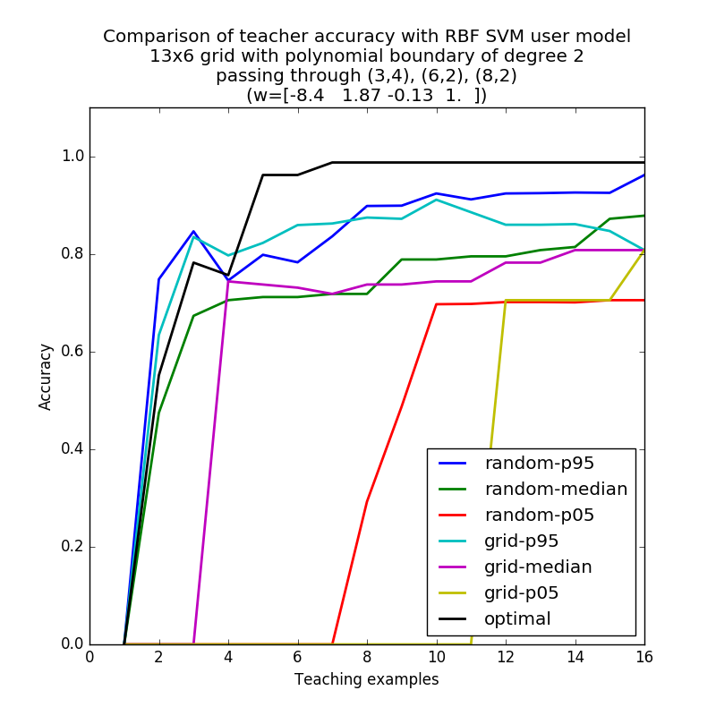

# Simulation results

## Sampling with replacement

I've enabled sampling with replacement for the optimal and random teachers. It doesn't seem fair to enforce sampling with replacement for the grid teacher, since the grid teacher covers a set of evenly spaced points by definition. With a linear boundary in 2D and a linear SVM user model, the optimal teacher seems to pick 3 distinct examples and then repeat the third one forever (Figure \ref{fig:linear}). As Anca said, this is a useful way to determine that the optimal teacher has converged.

## Additional user models

I've added basically all of the user models Sandy had:

* SVM with RBF kernel
    * $C = 1, \gamma = 0.1$ (pretty default parameters)
    * $C = 528, \gamma = 0.001$ (the best parameters from Sandy's grid search for fitting to real user data)
* Online kernel machine (OKM) as in Anca's RoMan paper (2012). This performs function approximation of $P(Y=1|X)$ by adding a Gaussian bump (positive or negative) for every incoming example. The contributions of old examples are reduced over time.
    * $\eta = 0.85, \lambda = 0.05, w = 1$ (These draw upon Sandy's parameters from grid search, though I may have picked the wrong ones.) Starts with an uninformative "prior"/initial guess of $P(Y=1|X) = 0.5$.
* KDE
    * Gaussian kernel with bandwidth = $I_d$ by default
* Generalized context model (GCM), a model from cognitive science where the class-conditional density (unnormalized) of $x$ depends on class examples $x_1^n$ as follows: $s(x, x_1^n) = \sum_{i=1}^n \exp(-c d(x, x_i)^\alpha)$. Reducing kernel is not yet implemented.
    * $c = 1, \alpha = 2, d(x, y) = \frac{1}{d}\lVert x - y \rVert_r, r = 1$. These are pretty default parameters, with $r = 1$ chosen to differentiate GCM more from KDE.

The first two are discriminative; the latter two are generative.

We can easily run any of these user models with other parameter settings. I haven't really put time into tuning parameter settings. This regime where the teacher has complete knowledge of the user model is overly simplified anyway.

## Nonlinear boundaries

To go along with the additional user models, I tried a variety of nonlinear boundaries:

* Polynomial of degree $m$ that passes through $m+1$ randomly sampled points in the grid. I tried $m = 2,3,4$; you can set it as high as you like.
* Hardcoded functions like $e^x$, $\sin x$ and $x \sin x$

For sample boundaries, see Figure \ref{fig:quadratic}, \ref{fig:cubic}, \ref{fig:sinusoidal}.

## Observations

### Random teacher degrades in high dimensions again

As we saw for teaching a linear boundary to a linear SVM, randomly teaching a nonlinear boundary to an RBF SVM degrades in higher dimensions. Compare the accuracy of randomly teaching a degree-2 polynomial in $x,y$ with free $z$ coordinate (Figure \ref{fig:5x5x5-poly-2}) to the accuracy of randomly teaching a degree-2 polynomial in just $x,y$ (Figure \ref{fig:13x6-poly-2}). 

### Grid teaching can get worse with more examples

A grid teacher can be poor at teaching nonlinearities to an RBF SVM, since examples are predictable and sparse. The 95th percentile grid teacher sees accuracy decline slightly as more examples come in. This happens on a quadratic boundary (Figure \ref{fig:13x6-poly-2}), higher-degree polynomial boundaries, and sinusoidal boundaries (Figure \ref{fig:13x6-xsinx}).

### With the right parameters, RBF SVM can be taught nonlinear boundaries

An RBF SVM with parameter settings $C = 1, \gamma = 0.1$ is taught by an optimal teacher to a higher final accuracy than an RBF SVM with $C = 528, \gamma = 0.001$ on "wiggly" boundaries like degree 3 and 4 polynomials and sinusoidal functions. This is predictable, since a smaller $\gamma$ means that examples farther away exert more influence over the learned boundary. Larger $C$ places more weight on the loss, preferring a more complex boundary, but the smaller $\gamma$ seems more influential here. Compare the accuracy of optimally teaching an RBF SVM a cubic boundary in Figures \ref{fig:svm-params-1} ($C = 1, \gamma = 0.1$) and \ref{fig:svm-params-2} ($C = 528, \gamma = 0.001$).

With more complex boundaries, the optimal teacher starts repeating examples later. For instance, teaching a quadratic boundary to an RBF SVM, all examples after the 7th are repeats (Figure \ref{fig:optimal-repeats-nonlinear}).

### Optimal teaching creates greater improvement on nonlinear boundaries when the user model is KDE or OKM

Optimally teaching an RBF SVM a complex boundary like cubic polynomials and sinusoidals hits a ceiling below 100% accuracy. KDE and OKM seem like more flexible user models at the given parameter settings, since they can be optimally taught to close to 100% accuracy. To see this happen on the $sin x$ boundary, consult Figures \ref{fig:sin-rbf-svm}, \ref{fig:sin-kde}, \ref{fig:sin-okm}.

 

 

 

### Optimally teaching an OKM results in high uncertainty across the grid

Predictions from user models are obtained by thresholding $P(Y=1|X)$ at 0.5; the optimal teacher seeks to minimize prediction error. The actual values of $P(Y=1|X)$ could be close to 0.5, however. Prediction certainty is not currently factored into our notion of optimality. As a result, optimal teaching of an OKM model results in uncertainty across large parts of the grid, whether the boundary is linear (Figure \ref{fig:okm-linear-evals}), higher-degree polynomial or exponential. By contrast, KDE at its default parameter setting allows for more certain predictions (Figure \ref{fig:kde-linear-evals}).

