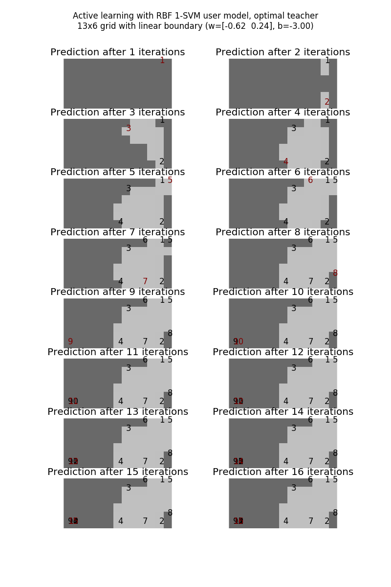
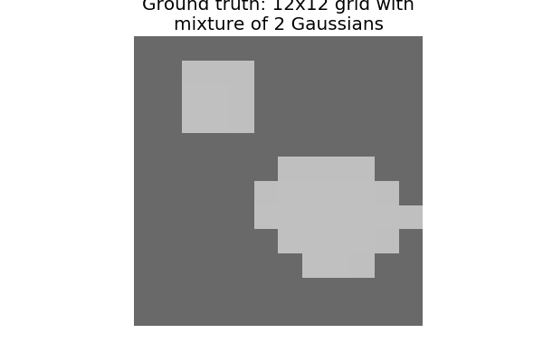

# A correction

Previously I reported that random teaching degrades in high dimensions. I found a bug in my code that inflated prediction error in higher dimensions. The following figures show accuracy of optimal, random and grid teaching on 13x6, 5x5x5 and 3x3x3x3 grids with the bug corrected. The effect of dimension on the suboptimality of random and grid teaching becomes a lot less pronounced.

{ width=50% }
{ width=50% }
{ width=50% }

# One-class user model

I added a user model that uses a 1-class SVM as in Scholkopf et al. The learner only uses training examples of the positive class (light gray); any training examples from the negative class (dark gray) are discarded. All results use an RBF kernel with width parameter $\gamma=0.1$. 

I started by setting $\nu = 0.05$. On the 13x6 linear boundary, optimal teaching causes the learner to sweep out the corners of the positive region (Figure \ref{fig:13x6-linear-nu0.05-preds}). Note that the optimal teacher chooses to teach only negative examples after the 11th, which is equivalent to halting the teaching as these examples are discarded.

{ width=60% }

Optimal teaching peaks at an accuracy of less than 100% (Figure \ref{fig:13x6-linear-nu0.05-accuracy}). Compared to the linear 2-class SVM, the 1-class SVM user model with RBF kernel does not learn the linear boundary as well when optimally taught. However, when the user model is a 1-class SVM, optimal teaching maintains a clear advantage over random and grid teaching. Random and grid teaching on the 2-class SVM close the gap with optimal teaching quickly.

{ width=50% }

Figures \ref{fig:13x6-linear-nu0.05-precision} and \ref{fig:13x6-linear-nu0.05-recall} show the precision and recall of teaching the 1-class SVM the linear boundary. Precision reaches 100% quickly for the optimal teacher and the top grid/random teachers, but recall stays below 90% for the optimal teacher and 65% for the top grid/random teachers. The lower eventual accuracy of the 1-class SVM seems to be explained by its conservatism: it fits a tight boundary around the positive training examples. As a result, it incurs few if any false positives, but many false negatives.

{ width=50% }

{ width=50% }

Perhaps 1-class SVM with a higher $\nu$, which allows for more outliers and support vectors in the training set, would be less conservative. All remaining simulations use a $\nu = 0.5$. As Figure \ref{fig:13x6-linear-nu0.5-preds} shows, the predictions are similar, with the optimal teacher choosing to stop after the 8th training example. Optimal teaching still converges to a lower accuracy than a 2-class SVM, but it converges slightly faster with $\nu = 0.5$ (Figure \ref{fig:13x6-linear-nu0.5-accuracy}).

{ width=60% }

{ width=50% }

On the one hand, making a case for the 1-class SVM over other user models depends on cognitive science, if the user is a human. On the other hand, it would still be helpful to establish when 1-class SVM can be taught to a higher accuracy than 2-class SVM. I think the data-generating distribution would need to heavily prefer positive examples for this to be the case. Currently, all grid points are equally considered for teaching, and accuracy is measured by weighting all grid points uniformly -- a setting that probably prefers the 2-class SVM.

I have not tried changing the data-generating distribution yet, but that is a possible next direction.

The final results show the performance of 1-class SVM and 2-class SVM on boundaries that might be favorable to 1-class SVM. For the first boundary, the positive region has a Gaussian shape (Figure \ref{fig:10x8-gaussian-gt}). For the second boundary, the positive region looks like a mixture of Gaussians (Figure \ref{fig:12x12-gaussian-gt}). Note that the data-generating distribution has not become Gaussian; it is still uniform across the grid.

{ width=30% }

{ width=30% }

The 2-class SVM achieves slightly better accuracy on the first boundary. On the second boundary, the 1-class SVM and 2-class SVM achieve comparable accuracy.

{ width=50% }
{ width=50% }

{ width=50% }
{ width=50% }